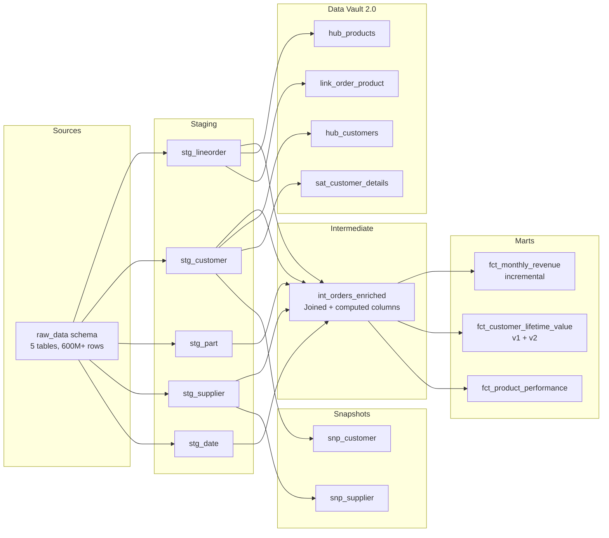

# ShopStream — dbt E-Commerce Warehouse

## About the Data

This project uses the **Star Schema Benchmark (SSB)** dataset — a standardized benchmark for data warehouse performance. The data models an e-commerce-like business with customers placing orders for products through suppliers.

### Source Tables

| Table | Rows | Description |
|-------|------|-------------|
| **lineorder** | 600M+ | Fact table — every order line item with revenue, cost, quantity, discount, shipping |
| **customer** | 3M | Customer dimension — name, address, city, nation, region, market segment |
| **part** | 1.4M | Product dimension — category, brand, manufacturer, color, type, size |
| **supplier** | 200K | Supplier dimension — name, city, nation, region |
| **dwdate** | 2.5K | Date dimension — year, month, day, season, holiday flags |

The data spans **7 years** (1992-1998) across **5 global regions** (America, Asia, Europe, Middle East, Africa) with products from multiple manufacturers and brands.

### Data Loading

Data is loaded from AWS public S3 bucket (`s3://awssampledbuswest2/ssbgz/`) into Redshift Serverless using the `COPY` command. A Python script (`scripts/setup_external_schema.py`) handles the full load process — creating schemas, tables, and executing COPY for all 5 source tables.

---

## What Was Built

### 1. Layered dbt Architecture

The project follows the **staging → intermediate → marts** pattern, separating concerns at each layer:

```
raw_data (source)  →  staging (clean)  →  intermediate (join)  →  marts (aggregate)
```

**Why layers?** Each layer has one job. Staging only renames. Intermediate only joins. Marts only aggregate. If business logic changes, you know exactly which layer to edit. If column names change in the source, only staging is affected — everything downstream uses the clean names.

---

### 2. Staging Layer — Column Renaming and Cleaning

**5 views** in `dev_staging` schema:
- `stg_lineorder` — renames `lo_orderkey` → `order_key`, `lo_custkey` → `customer_key`, etc.
- `stg_customer` — renames `c_custkey` → `customer_key`, `c_mktsegment` → `market_segment`, etc.
- `stg_part` — renames `p_partkey` → `part_key`, `p_mfgr` → `manufacturer`, etc.
- `stg_supplier` — renames `s_suppkey` → `supplier_key`, etc.
- `stg_date` — renames `d_datekey` → `date_key`, `d_sellingseason` → `selling_season`, etc.

**Materialized as views** — no storage cost, just SQL aliases. Any downstream model uses clean names without knowing the source's cryptic column naming.

---

### 3. Intermediate Layer — Joining Dimensions to Facts

**1 table** in `dev_intermediate` schema:
- `int_orders_enriched` — joins lineorder with all 4 dimensions (customer, part, supplier, date) and adds a computed column (`profit = revenue - supply_cost`)

**Materialized as table** — the join is expensive (600M × 4 dimension lookups). Materializing it means the join runs once and all downstream marts read from the stored result instead of re-joining.

---

### 4. Marts Layer — Business Metrics

**3 tables** in `dev_marts` schema, each answering a different business question:

**`fct_monthly_revenue`** — "How is revenue trending by region and product category?"
- Aggregates: total orders, total quantity, total revenue, total profit, avg discount, revenue per order
- Grouped by: year, month, customer region, product category

**`fct_customer_lifetime_value`** — "Who are our most valuable customers?"
- Aggregates: total orders, lifetime revenue, lifetime profit, years active, avg order value, categories purchased
- Grouped by: customer (one row per customer)

**`fct_product_performance`** — "Which products have the best margins?"
- Aggregates: total orders, unique customers, total quantity sold, total revenue, total profit, profit margin %, revenue per customer
- Grouped by: product (one row per product)

**Materialized as tables** — analysts and dashboards query these directly. Physical tables mean fast reads without recomputing aggregations on every query.

---

### 5. Snapshots — Tracking Dimension Changes Over Time (SCD Type II)

**2 snapshot tables** in `snapshots` schema:
- `snp_supplier` — tracks changes to supplier name, city, nation, region
- `snp_customer` — tracks changes to customer city, nation, region, market segment

**How it works:** On each `dbt snapshot` run, dbt compares current dimension values with previously stored values. If anything changed, it closes the old row (`dbt_valid_to = now`) and inserts a new row (`dbt_valid_from = now, dbt_valid_to = NULL`).

**Strategy:** `check` — compares specific columns to detect changes (used because source data has no `updated_at` timestamp).

**Business value:** Answers "What region was this customer in when they placed order X?" — point-in-time queries across dimension history.

---

### 6. Data Quality Tests

**Generic tests (YAML-defined):**
- `not_null` — critical columns must never be NULL (order_key, customer_key, revenue)
- `unique` — dimension keys must be unique (customer_key, part_key, supplier_key, date_key)
- `accepted_values` — region must be one of 5 valid values, market_segment must be one of 5 valid values
- `relationships` — foreign keys must exist in referenced table (every customer_key in lineorder exists in customer table)

**dbt_expectations tests (range validation):**
- `quantity` between 1 and 50 (no impossible order quantities)
- `discount_pct` between 0 and 10 (business rule: max 10% discount)
- `year` between 1992 and 1998 (SSB data range)
- `month_num_in_year` between 1 and 12
- `total_orders` >= 1 (aggregation can never be zero)
- `lifetime_revenue` >= 0 (no negative CLV)
- `profit_margin_pct` between 0 and 100

**Singular tests (custom SQL assertions):**
- `assert_revenue_is_positive` — no line items with negative revenue
- `assert_no_future_orders` — no orders dated in the future

---

### 7. Documentation

Every model, every column has a `description` in YAML schema files. Running `dbt docs generate` + `dbt docs serve` produces a full documentation site with:
- Model descriptions and column definitions
- Lineage graph (visual DAG showing data flow from sources through to marts)
- Test coverage per model
- Custom overview page explaining the project structure

---

### 8. Macros — Reusable SQL Logic

**`profit_margin(revenue_col, cost_col)`** — calculates profit as percentage of revenue with division-by-zero handling. Used in `fct_product_performance`.

**`cents_to_dollars(column, decimal_places)`** — converts integer cents to decimal dollars. Reusable across any model that deals with monetary values.

**`generate_schema_name(custom_schema_name, node)`** — controls how dbt names schemas per environment. Produces `dev_staging`, `dev_marts` in development and `prod_staging`, `prod_marts` in production.

---

### 9. Packages

- **dbt_utils** — utility macros (surrogate keys, pivot, unpivot, date spine)
- **dbt_expectations** — data quality tests inspired by Great Expectations (range checks, distribution tests, type validation)

---

### 10. CI/CD (GitHub Actions)

On every PR to main:
1. **SQLFluff lint** — enforces consistent SQL style (lowercase keywords, 4-space indent)
2. **dbt deps** — installs packages
3. **dbt compile** — validates all SQL syntax and references
4. **dbt build** — runs models + tests against dev environment

---

### 11. Environment Separation

`profiles.yml` defines two targets:
- **dev** — `dbt run` locally writes to `dev_staging`, `dev_intermediate`, `dev_marts`
- **prod** — `dbt run --target prod` (CI on merge) writes to `prod_staging`, `prod_intermediate`, `prod_marts`

Same code, different schemas. Development experiments never touch production tables.

---

## Architecture Diagram



## Setup

### Prerequisites
- Python 3.11+
- dbt-redshift
- AWS account with Redshift Serverless

### Deploy Infrastructure
```bash
cd terraform
source .env
terraform init && terraform apply
```

### Load Data
```bash
source terraform/.env
export COPY_ROLE_ARN=$(cd terraform && terraform output -raw redshift_copy_role_arn)
python3 scripts/setup_external_schema.py
```

### Run dbt
```bash
source virenv/bin/activate
dbt deps
dbt run
dbt snapshot
dbt test
dbt docs generate && dbt docs serve
```

## File Structure

```
dbt-ecommerce-warehouse/
├── models/
│   ├── staging/            # Views — clean column names
│   │   ├── _sources.yml    # Source definitions + descriptions
│   │   ├── _schema.yml     # Tests + column docs for staging models
│   │   ├── stg_lineorder.sql
│   │   ├── stg_customer.sql
│   │   ├── stg_part.sql
│   │   ├── stg_supplier.sql
│   │   └── stg_date.sql
│   ├── intermediate/       # Table — joins + enrichment
│   │   └── int_orders_enriched.sql
│   ├── marts/              # Tables — aggregated metrics
│   │   ├── _schema.yml     # Tests + column docs for marts
│   │   ├── fct_monthly_revenue.sql         # incremental
│   │   ├── fct_customer_lifetime_value_v1.sql  # deprecated
│   │   ├── fct_customer_lifetime_value_v2.sql  # current
│   │   └── fct_product_performance.sql
│   ├── vault/raw/          # Data Vault 2.0 (insert-only)
│   │   ├── stg_vault_orders.sql      # hash key computation
│   │   ├── stg_vault_customers.sql   # hash key + hash_diff
│   │   ├── hub_customers.sql         # customer business keys
│   │   ├── hub_products.sql          # product business keys
│   │   ├── link_order_product.sql    # customer↔product relationship
│   │   └── sat_customer_details.sql  # customer attribute history
│   └── overview.md         # Custom docs landing page
├── snapshots/
│   ├── snp_supplier.sql    # SCD Type II for supplier changes
│   └── snp_customer.sql    # SCD Type II for customer changes
├── macros/
│   ├── profit_margin.sql
│   ├── cents_to_dollars.sql
│   └── generate_schema_name.sql
├── tests/
│   ├── assert_revenue_is_positive.sql
│   └── assert_no_future_orders.sql
├── terraform/              # Infrastructure (Redshift + IAM)
├── scripts/                # Data loading from S3
├── dbt_project.yml         # Project config + materializations
├── profiles.yml            # Connection config (dev + prod targets)
├── packages.yml            # dbt_utils + dbt_expectations
├── .sqlfluff               # SQL linting rules
└── .github/workflows/      # CI pipeline
```

## Design Decisions

- **Table for intermediate (not ephemeral):** The 600M row join is expensive. Ephemeral would re-execute it for each mart (3× cost). Table stores it once.
- **View for staging:** No storage cost — just SQL aliases for clean names. Always fresh (reads from source on query).
- **Incremental for int_orders_enriched + fct_monthly_revenue:** 3-day lookback window catches late corrections without reprocessing 600M rows. Second run takes seconds vs minutes.
- **delete+insert over merge:** Proven pattern on Redshift. Deletes affected rows then re-inserts — same result as merge but more compatible.
- **Model versioning for CLV:** v1 deprecated (sunset 2026-09-01), v2 adds `avg_discount_pct` + `unique_suppliers`. Consumers migrate at their pace.
- **Data Vault for raw layer:** Insert-only, full auditability, parallel loading. Hubs/links/sats track all history without ever updating.
- **Plain MD5 over automate_dv package:** automate_dv's hash macro uses DECODE which is incompatible with Redshift. Raw MD5 with concatenation is simpler and works everywhere.
- **check strategy for snapshots:** Source data has no `updated_at` column. Check strategy compares column values directly.
- **Separate schema per layer:** Clear separation in Redshift. Analysts know `prod_marts.*` is trustworthy. `dev_staging.*` is work-in-progress.
- **Slim CI with manifest branch:** Production manifest stored in a git branch (not artifacts). Cross-workflow accessible. PRs only build modified + downstream models.
- **Tags for scheduling:** `hourly` (staging views — always fresh), `daily` (intermediate, marts, vault — batch updates).
- **dbt_expectations over custom SQL:** Declarative range tests in YAML are easier to maintain than writing custom SQL for every boundary check.
